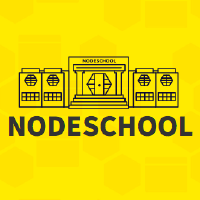

NodeSchool is an open source project run by volunteers with two goals: to create high quality programming curriculum and to host community learning events.

---

### Interactive tutorials

The "workshopper" format was first created by [Substack of the Internet](http://substack.net/) in Summer 2013 when he wrote the [stream-adventure](https://www.npmjs.org/package/stream-adventure) workshopper.

The defining characteristic of the workshopper is the interactivity and automation. Workshoppers are made up of challenges of increasing difficulty. Each challenge starts by explaining a concept, and then presents a list of requirements for solving the challenge. Learners then try and write a computer program that satisfies the criteria.

When they feel confident about their solution they submit it to the workshop for verification. The workshop runs their solution and checks if all requirements were satisfied. If any are wrong or missing the learner gets contextual feedback and they can try again. If their code passes all of the criteria then they pass the challenge and move on to the next challenge.

All of this happens in an automated way. Workshoppers can be thought of almost like a unit test suite that the learner must make pass by implementing the correct code.

---

### A wide range of topics

All of the NodeSchool workshops are written using Node, but the subject of a workshop doesn't necessarily have to be about Node. For example the [shader-school](https://www.npmjs.org/package/shader-school) workshop teaches computer graphics concepts and doesn't involve writing JavaScript at all.

The NodeSchool community has developed some really great tools for authoring new workshops. If you have an idea for a workshop we encourage you to check out our [Building Workshops](https://nodeschool.io/building-workshops.html) page.

---
